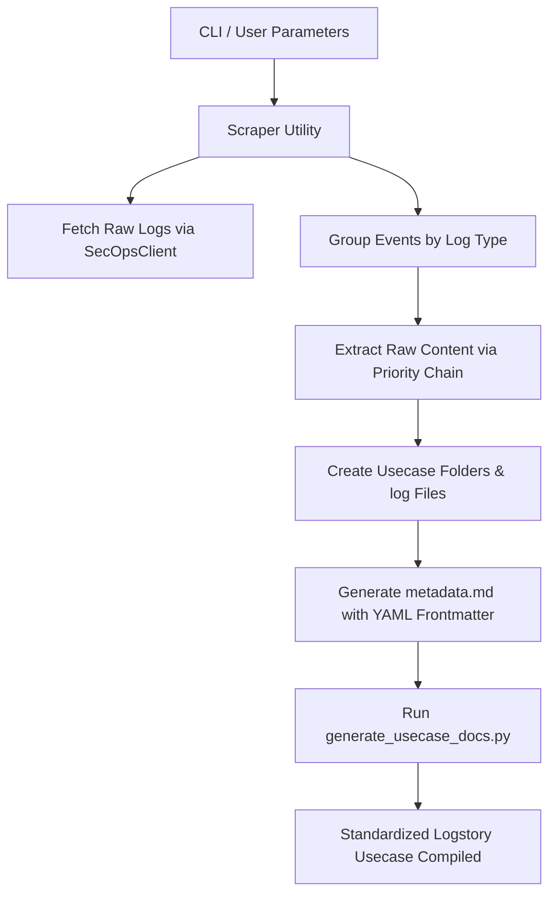

# Product Requirements Document (PRD): SecOps Log Scraper for Logstory

## 1. Objective & Goal
The objective is to design and build an automated script/utility that scrapes raw logs from a Google SecOps (Chronicle) tenant over a configurable time interval, normalizes the logs to follow Logstory's structure and naming conventions, and packages them as a brand-new Logstory use case ready for ingestion.

This utility will automate the creation of high-fidelity test cases, capture range scenario logs, and ease the validation process for rules, search features, and parsers.

---

## 2. Target Directory & Layout
The utility will create a new use case directory inside the `usecases` folder:
`usecases/<usecase_name>/`

Inside this directory, the standard Logstory structure will be generated:
```
<usecase_name>/
├── EVENTS/                  # Normalized raw log files (*.log)
├── ENTITIES/                # Placeholder for entity files (empty)
├── RULES/                   # Placeholder for YARA-L rules (empty)
├── SEARCH/                  # Placeholder for saved searches (empty)
├── PARSER_EXTENSIONS/       # Placeholder for parser extension files (empty)
├── <usecase_name>.md        # Metadata document with YAML frontmatter
└── <usecase_name>_generated.md  # Standardized generated documentation
```

---

## 3. Key Requirements & Functional Specifications

### 3.1 Parameterized Usecase Naming
* **Parameter**: `--name` / `-n` (string).
* **Fallback**: If not provided, the folder and files will be named after the current UTC ISO timestamp in the format: `YYYYMMDD_HHMM` (e.g., `20260528_0906`).
* **Validation**: Sanitized to secure characters (alphanumeric and underscores only).

### 3.2 Log Scraping & Interval Parameters
* **Interface**: Integrates with the `ChronicleClient` and `search_raw_logs` method.
* **Interval Parameters**:
  * `--time-window` / `-w` (int): Number of hours in the past to query (defaults to `24`).
  * `--start-time` / `--end-time` (string): Specific UTC datetime range in ISO format (`YYYY-MM-DDTHH:MM:SSZ`).
* **Search Query**:
  * `--query` / `-q` (string, required): Baseline filter query for the raw log search.
  * **Safety Default**: Always enforce a `--page-size` (default: `100` or custom via CLI) to prevent server-side resource exhaustion (`500` status codes) on high-volume queries in sandbox/staging tenants.
* **Interval Splitting / Time-Chunking Loop**:
  * Since the raw log search API (`:searchRawLogs`) does not support request-side pagination input parameters, the utility must partition the target time range into stateful time slices/chunks (e.g. 2-minute slices) and execute consecutive queries client-side to retrieve the complete log history without truncation or server-side resource failures.
  * **Chunk Size Parameter**: Add `--chunk-size` / `-c` (int, default: `2` in minutes) to specify the duration of each time slice query.
  * **Safety Ceiling Parameter**: Add `--max-events` / `-m` (int, default: `10000`) as a safe total event limit ceiling to abort recursive chunk queries early when scanning very large volumes.
* **Log Types Filter**:
  * `--log-types` / `-t` (string): Comma-separated list of raw log type identifiers to limit results (e.g., `"WINEVTLOG,OKTA"`).

### 3.3 Log Formatting & Naming Convention Conversion
When logs are retrieved from the API, they must be parsed, grouped, and saved following the strict Logstory guidelines:
* **Log Grouping**: Logs are grouped by their respective log type identifier (`metadata.log_type` or fallback to `logType.displayName`).
* **Filename Convention**: Grouped files are written to uppercase files: `<LOG_TYPE>.log` (e.g. `POWERSHELL.log`, `WINDOWS_SYSMON.log`, `WINEVTLOG.log`).
* **Raw Content Extraction Chain**: The original raw string representation must be extracted from the match elements with a safe priority fallback chain:
  1. `logText` field (direct original raw string).
  2. Base64-decoded `rawRecord` bytes value.
  3. `event.udm.additional.Message` field (common parsed syslog/windows message fallback).
  4. **Fallback**: Format the entire event structure as a single-line JSON string (standard line-by-line JSON format).
* **Output Location**: Saved inside the `<usecase_name>/EVENTS/` subfolder.

### 3.4 Automated Metadata & Documentation Generation
* **YAML Frontmatter File**: Generate `<usecase_name>.md` inside the use case folder containing:
  * Usecase `title` and basic descriptions.
  * Auto-extracted metadata tags.
  * Timestamps (`created` and `updated` dates).
  * `events` array table listing each `<LOG_TYPE>.log` file generated along with its associated product and vendor names (auto-extracted from the first match of each type).
* **Documentation Compilation**: Invoke the existing Logstory template system utility `generate_usecase_docs.py` automatically to process templates and compile the final `<usecase_name>_generated.md` documentation file.

---

## 4. Proposed Implementation Architecture



---

## 5. Security & Safety Best Practices
* **No Secret Hardcoding**: Load all Google Cloud Default Credentials (ADC) and tenant identifiers from the active shell session or the local/global configuration file folders.
* **Line Limit Compliance**: All newly created Python modules must conform to the project-standard style guides and keep line lengths below 80 characters.
* **Ignored Git Files**: Ensure that any credentials, scratch output files, or local logs are excluded by `.gitignore` and never committed or tracked in git.
